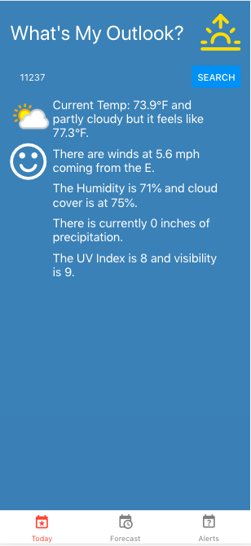

# MyWeatherApp
a mobile iOS app that gives you weather info by zip code including current weather, forecasted weather for the next 5 days, and weather alerts from the National Weather Service.

In order for the API calls to work, you need to set up a free account with weatherbit.io and weatherapi.com. Then, add those 2 api keys: 
```WEATHER_API_KEY = 'key';```
```WEATHERBIT_API_KEY = 'key';```

To run the app, simpy run the script `expo start` and you should see the app running in your browser at `https://localhost:19006`.

NB: Right now, the current weather and forecast tab data are set for 20005/Washington, DC, but as soon as you search for a new zip code, the data will update. You can change the defaults in the search hook on lines 85 and 155, respectively.

### Screenshots



